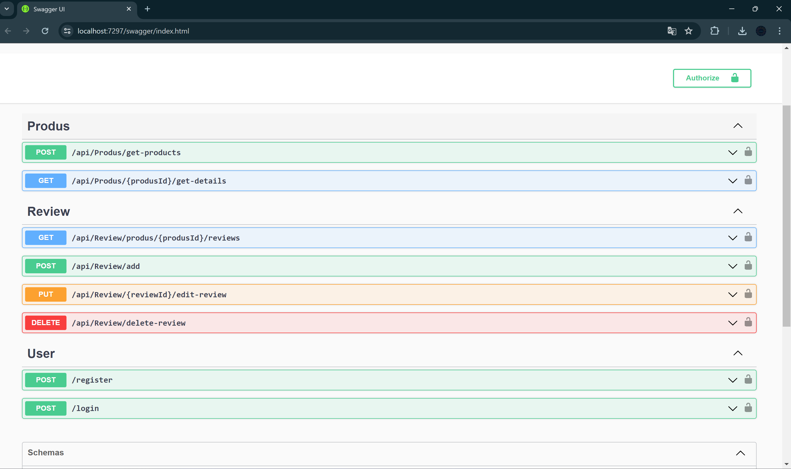

# Project Name: ProductCatalogAPI

## Description:
This project is a Web API for managing a product catalog, developed in C# using .NET Web API. It features a robust architecture, following the best practices of RESTful API development to ensure scalability and maintainability.



## 📌 Features:
- **CRUD Operations**: Create, Read, Update, Delete products
- **Search Functionality**: Search products by name or category
- **Pagination**: Efficiently handle large datasets with pagination
- **Authentication**: Secure API endpoints with JWT authentication
- **Logging**: Detailed logging for monitoring and debugging

## 🚀 Getting Started:
### Prerequisites:
- [.NET SDK](https://dotnet.microsoft.com/download)
- [Other necessary tools/libraries]

### Installation:
1. Clone the repository:
    ```bash
    git clone https://github.com/yourusername/ProductCatalogAPI.git
    ```
2. Navigate to the project directory:
    ```bash
    cd ProductCatalogAPI
    ```
3. Restore the dependencies:
    ```bash
    dotnet restore
    ```

### Usage:
1. Build the project:
    ```bash
    dotnet build
    ```
2. Run the project:
    ```bash
    dotnet run
    ```

## 📊 API Endpoints:
### Endpoint 1: Get All Products
- **URL**: `/api/products`
- **Method**: `GET`
- **Description**: Retrieve a list of all products
- **Parameters**: `page` (optional), `pageSize` (optional)
- **Response**: 
  ```json
  [
      {
          "id": 1,
          "name": "Product 1",
          "category": "Category A",
          "price": 100.0
      },
      ...
  ]
